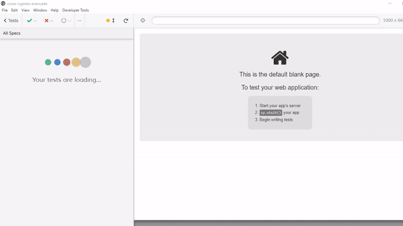

# Testes Automatizados com Cypress - Avançado

👋 Seja bem vindo(a)!

É muito bom tê-lo(a) aqui. Tenho certeza que você vai adorar este projeto. ❤️

Este projeto é referente ao curso de Cypress nível Avançado da escola Talking About Testing online school.

    

## O que aprendi

Durante o curso avançado de Cypress, eu aprendi aprender:

- Como criar testes 100% _flakiness-free_
- Como interagir com a aplicação o mais próximo de como um usuário real faria
  - Como esperar por um elemento estar visível antes de interagir com ele
  - Como simular o uso do teclado em vez de clique em botão em funcionalidades de busca
  - Como esperar por requisições HTTP antes de seguir em frente com os testes
- Como organizar diferentes testes em seus específicos contextos
- Como ler o `localStorage` do navegador
- Como tornar seletores de elementos mais específicos
- Como simplificar comandos repetitivos
- Como interceptar e mockar uma API externa para testar o frontend independente do backend
- Como simular erros no servidor e na rede
- Como simular lentidão na chamada à uma API
- Como modificar o relatório de testes padrão para um que combine com o seu estilo 😉
- O desafio proposto pelo Walmyr na aula 11 só consegui implementar após ler o artigo no [Blog](https://talkingabouttesting.com/2021/05/05/como-testar-que-o-chache-funciona-em-um-teste-escrito-com-cypress/) da Escola Talking About Testing.

## Pré-requisitos

Vá para a seção de [pré-requisitos](./lessons/0.md).

## Apoiar esse projeto

Se você gostar desse projeto deixa uma ⭐.

___

Este projeto foi feito por [Pet 🐕](https://www.linkedin.com/in/petherson-erasmo/) enquanto assista o curso de cypress da [**Escola Talking About Testing**](https://udemy.com/user/walmyr).
